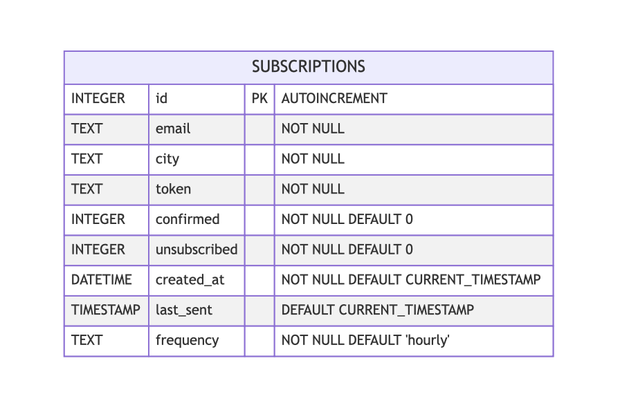

# ADR-001: Вибір бази даних для зберігання підписок

Created by: Назар Парносов
Created time: June 9, 2025 12:01 AM

## Контекст

Потрібно створити базу даних для сервісу надсилання на пошту погоди за підпискою. Зберігатись має:

- зберігання користувачів зі:
    - електронної пошти
    - Станом підписки:
        - Підписаний
        - Підтверджений
        - Відписаний
    - містом слідкуванням погоди
    - частоти надсилання
    - час останнього оновлення

## Розглянуті варіанти

1. PostgreSQL

   Плюси: надійність, ACID-сумісність, розширюваність

   Мінуси: складніше налаштування, вимоги до ресурсів

2. SQLite

   Плюси: мінімальні залежності, запускається “з файлу”

   Мінуси: обмежена одночасність, не production, мало типів

3. MongoDB

   Плюси: гнучка схема, легке шардування

   Мінуси: eventual-консистентність

   ### Обраний варіант - **SQLite**

   ## Схема бази:

   

   ## Наслідки:

   **Позитивні:**

    - “Zero-config” — нема потреби в окремому сервері або адмініструванні
    - Мінімальні архітектурні вимоги — усе в одному файлі
    - Швидка робота в режимі читання

   **Негативні:**

    - Не витримає великого навантаження (для тестового трафік не планується)
    - Далекр не всі типи присутні
