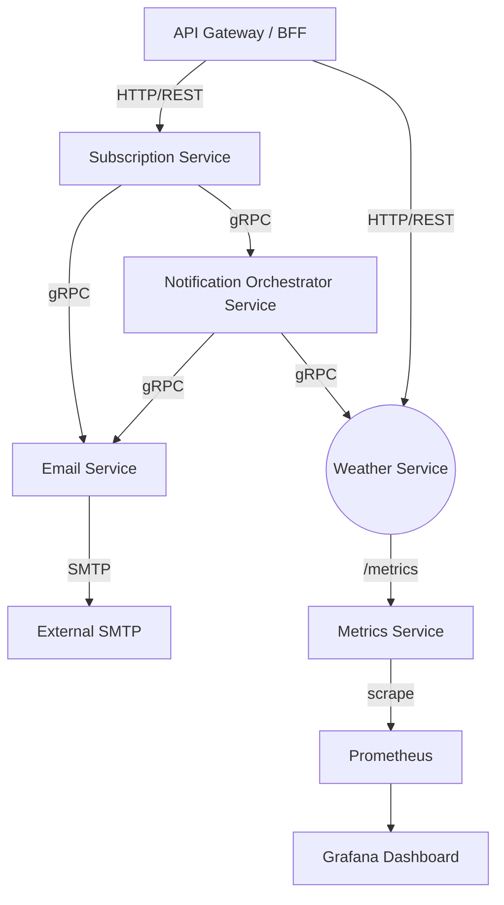

# ADR-002: Microservices split

Created by: Назар Парносов

## Context:

My current service is a monolithic codebase responsible for handling user weather get requests and subscriptions, fetching weather data from external APIs, caching, sending email notifications with weather updates, and exposing metrics for monitoring. And for now I have the task to highlight a possible modules to extract to separate micro-service. And choose optimal option for communication type for each service.

## Decision:

1. **API Gateway / BFF**: Central entry point for all client requests, routing, and cross-cutting concerns.
2. **Subscription Service**: Manages user subscriptions (CRUD) and publishes subscription lifecycle events.
3. **Weather Aggregator Service**: Retrieves weather data from external APIs, applies caching via Redis, and exposes a REST/gRPC interface.
4. **Notification Service**: Listens to subscription and weather events, composes and create notification event to send email
5. **Metrics Service**: Collects and exposes operational metrics (via Prometheus client) for monitoring.
6. **Grafana Service**: Collect metrics from Prometheus and shows it in beautiful and easy readable diagrams
7. **Email Service**: Sends all types of transactional emails (confirmation codes, alerts) via SMTP; implements templating.

Each service owns its own datastore or cache if it is necessary  (e.g., Postgres for subscriptions, Redis for caching) and communicates via lightweight protocols (REST or gRPC)

## **Alternatives Considered:**

- **Keep the Monolith**: Continue with the existing codebase. *Rejected* due to scaling bottlenecks and deployment overhead.
- **Modular Monolith**: Refactor into modules within the same deployable unit. *Partially addresses* code separation but still couples deployment and runtime.

## **Consequences**

### Positive:

- **Independent Scaling**: Services can scale individually (e.g., autoscale Weather Aggregator or Email Service under high load).
- **Fault Isolation**: Email failures do not bring down subscription or weather logic.
- **Faster Deployments**: Deploy only the modified service, reducing risk and downtime.

### Negative:

- **Operational Overhead**: Increased complexity in managing multiple services and their deployments (e.g., Kubernetes, service mesh).
- **Distributed System Complexity**: Must handle inter-service latency, retries, and eventual consistency.

## Technical Notes

I need to compare to communication protocols (HTTP and gRPC) and choose which to choose for each inter-microservice communication.

### HTTP vs gRPC

| Aspect | HTTP/REST | gRPC |
| --- | --- | --- |
| **Message Format** | JSON (text-based, verbose) | Protocol Buffers (binary, compact) |
| **Performance** | Higher latency and CPU overhead parsing JSON | Lower latency, efficient serialization |
| **Streaming Support** | Limited (server-sent events, WebSockets) | Built-in bi-di and uni-directional streaming |
| **Type Safety** | Weakly typed; hard to deserialize: runtime errors for mismatches | Strongly typed with code-generated stubs |
| **API Definition** | Informal or OpenAPI spec | Formal via .proto files |
| **Tooling** | Mature ecosystem; broad language support | Growing ecosystem; wide language support |
| **Use Cases** | Public-facing APIs, simple CRUD interactions | High-performance, inter-service communication, real-time streaming |
| **Browser Support** | Native support in browsers and HTTP clients | Requires gRPC-Web proxy or gateway; limited native browser support |

### **Chosen Protocol per Service Interaction**

| Caller | Callee | Protocol | Rationale |
| --- | --- | --- | --- |
| API Gateway | Subscription Service | HTTP/REST | External-facing; broad client compatibility |
| API Gateway | Weather Aggregator Service | HTTP/REST | Exposed to UI; leverages HTTP caching semantics |
| Subscription Service | Notification Orchestrator | gRPC | Low-latency, internal command invocation |
| Notification Orchestrator | Email Service | gRPC | Efficient, typed calls for transactional emails |
| Subscription Service | Email Service | gRPC | Direct send of confirmation code emails |
| Notification Orchestrator | Weather Aggregator Service | gRPC | Fast retrieval of weather data for notifications |
| Weather Aggregator Service (in future more)  | Metrics Service | HTTP/REST | Prometheus scraper pulls `/metrics` endpoints |

## Result Service Architecture

In future consider to add a message broker for some communication between services.

## Summary:

Split the monolith into focused microservices for scalability, fault isolation, and faster deployments, using REST (client/metrics), gRPC (internal), SMTP (email).