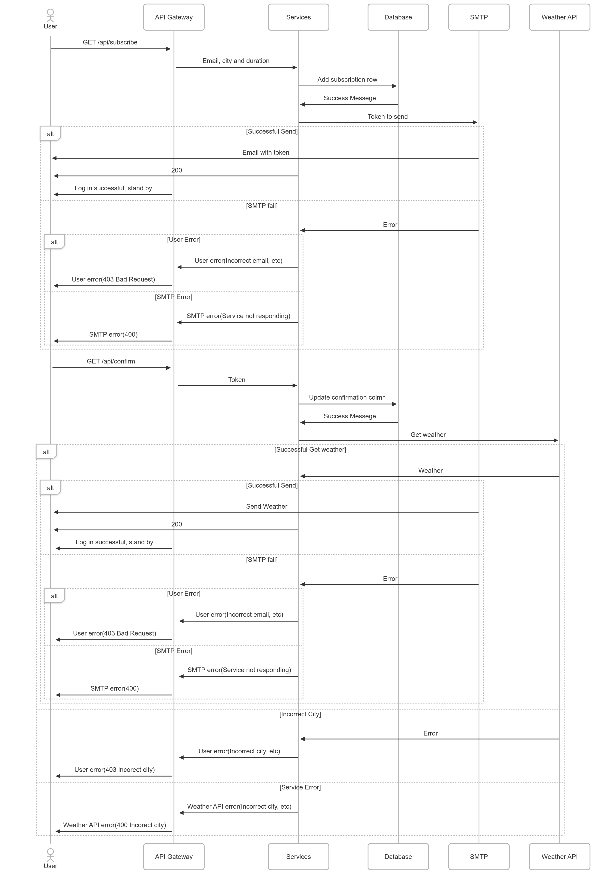

# System Design: Weather Subscriptions API

Created by: Назар Парносов

## Вимоги системи:

- Функціональні:
    - Користувацька підписка на оновлення погоди у вибраному місті по email
    - Підтвердити свою пошту, отриманим код на email
    - Вибрати періодичність оновлень на пошту: Погодинно/щоденно
    - Отримати поточну погоду в конкретному місті
    - Відписатись від сервісу
- Не Функціональні
    - **Повнота** - якщо є якась помилка, через яку користувач не отримає дані, повідомити його про це
    - **Читабельність коду** - ревюер має добре зрозуміти та прочитати код
    - **Безпека** - ключі мають бути зашфровані
    - **Доступність** - час надсилання повідомлення на пошту < 1 хв
    - **Відмовостійкість** - сервіс не повинен падати без бази або апі
- Обмеження
    - Короткі терміни розробки
    - Відсутній бюджет для підтримки зовншіньої API

## Рішення

1. User flow

   

    - Користувач викликає один із ендпоінтів підписки (`/api/subscribe`, `/api/confirm`, `/api/unsubscribe`) або прямий запит погоди (`/api/weather`).
    - Запит потрапляє в шар **Services**, де відпрацьовується бізнес-логіка: створення/підтвердження/скасування підписки або отримання поточних даних погоди з зовнішнього API.
    - **Services** зберігає чи читає інформацію (email, місто, токен, статуси, `last_sent`, `frequency`) у **SQLite**.
    - У разі підписки або запиту погоди **Services** формує й надсилає відповідний лист.
2. Архітектура

   

    1. Клієнт робить HTTP-запит до одного з під-API (`/api/subscribe`, `/api/confirm`, `/api/unsubscribe` або `/api/weather`).
    2. Запит проходить через **Handlers**, які викликають відповідні методи шару **Services**.
    3. **Services** опрацьовують бізнес-логіку:
        - читають/записують дані (email, місто, `last_sent`, `frequency` тощо) через **Repositories** в SQLite;
        - за потреби звертаються до зовнішнього Weather API для отримання поточного прогнозу.
    4. **Services** формують і відправляють email (підтвердження чи прогноз) через SMTP.
    5. **Notifier** періодично витягує підтверджені підписки через **Repositories** і делегує **Services** відправку запланованих повідомлень.
3. API EndPoints

    | Ендпоінт | Метод | Опис | Параметри |
    | --- | --- | --- | --- |
    | `/api/subscribe` | POST | Створити нову підписку | JSON: `{ "email": string, "city": string }` |
    | `/api/confirm` | GET | Підтвердити підписку за токеном | Query: `?token=<string>` |
    | `/api/unsubscribe` | GET | Відписатися від розсилки за токеном | Query: `?token=<string>` |
    | `/api/weather` | GET | Отримати поточний прогноз (та відправити email) | Query: `?city=<string>` |